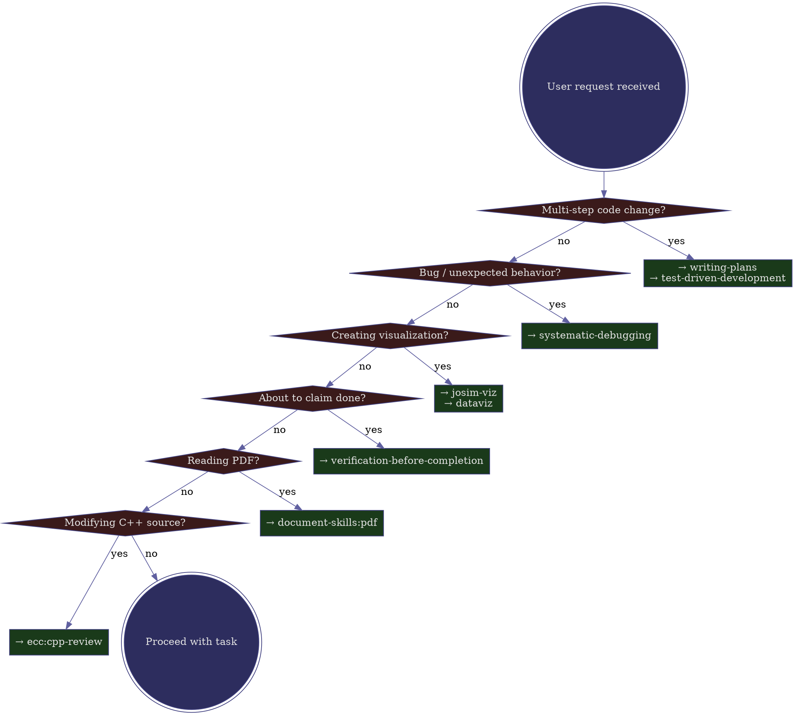

# Skill Router for JoSIM

> **Scope: JoSIM project ONLY.** This skill is installed at project level (`.claude/skills/`). The skill mappings reference JoSIM-specific skills (`josim-viz`) and JoSIM-specific conventions (ColdFlux cells, `.cir` netlists, `josim-cli`). Do NOT promote to global scope. It will not help (and may mislead) outside this repository.

## Overview

Decompose every user request into task components BEFORE taking any action. Map each component to its required skill(s). Invoke in strict priority order. **There is no task so simple it can skip this step.**

## Decision Flow

**Critical: a single request often triggers MULTIPLE branches.** "Simulate NOT and visualize" triggers both the visualization branch AND the multi-step branch. Walk ALL branches before proceeding.

## Quick Mapping Table

| What the user wants | Trigger words | Skills (in order) |
|---------------------|---------------|-------------------|
| Multi-step feature/fix | create, add, implement, build, 做, 写 | `writing-plans` → `test-driven-development` |
| Fix broken behavior | fix, broken, 失败, doesn't work, bug | `systematic-debugging` |
| Simulation results plot | plot, visualize, 画图, 看图, 可视化, 波形 | `josim-viz` → `dataviz` |
| Declare work done | done, passing, 完成, 通过, works | `verification-before-completion` |
| Read paper/spec PDF | .pdf, 论文, 文档 | `document-skills:pdf` |
| Changed C++ code | (modifies src/ or include/) | `ecc:cpp-review` |
| Design/architecture | design, architecture, 设计 | `superpowers:brainstorming` |

## Priority Rules (invocation order)

1. **Process** — brainstorming, writing-plans, systematic-debugging
2. **Implementation** — test-driven-development, cpp-review
3. **Output** — josim-viz, dataviz
4. **Verification** — verification-before-completion (ALWAYS last)

## Red Flags — STOP and re-evaluate

If you think any of these, you are about to skip a required skill:

| Thought | Reality |
|----------|---------|
| "This is straightforward, I'll just do it" | Simple tasks benefit most from structured process |
| "I already know what to do" | Knowing what ≠ doing it with proper checks |
| "I'll just run the simulation first" | Check skills BEFORE any action |
| "The plan is in my head" | Write it down with writing-plans |
| "I verified it manually" | Use verification-before-completion skill |
| "josim-plot2 handles the design" | dataviz handles color/accessibility standards |

## Real Failure Case (NOT task, 2026-07-12)

**What user asked:** "Read PDF, simulate NOT, visualize results"

**What was done wrong:**
- Called `writing-plans` but didn't follow the plan
- Skipped `test-driven-development` — wrote test directly
- Skipped `dataviz` — generated HTML without design standards
- Skipped `verification-before-completion` — declared ✅ before verifying

**Correct sequence would have been:**
1. `document-skills:pdf` → read PDF
2. `writing-plans` → plan the test
3. `test-driven-development` → write test with expected behavior first
4. Run simulation
5. `josim-viz` + `dataviz` → proper visualization
6. `verification-before-completion` → verify truth table before declaring pass
