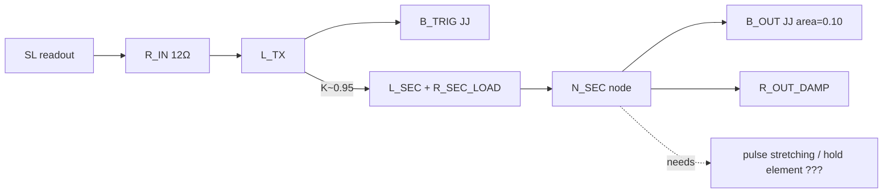
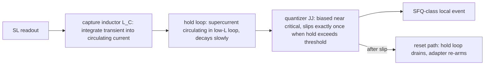
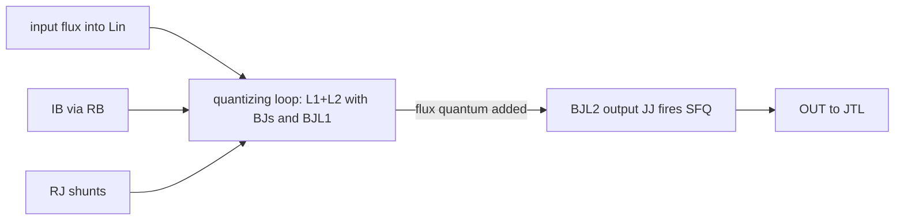

# Receiver architecture comparison — DIRECT vs LIGHTWEIGHT ADAPTER vs PAPER-STYLE QB

**Tier:** Exploration / EXPLORATORY (analysis only; no JoSIM runs, no BVM changes)
**Created:** 2026-08-21
**Evidence base:** R1a/R1b/R1c, R2-A…R2-G exploration checkpoints (`b7477d6` and ancestors)
**Question:** which receiver architecture should the next implementation-stage Exploration pursue?

---

## 1. Calibrated requirement extracted from R2 evidence

### Observed (each traceable to a committed experiment)

| # | Fact | Source |
|---|---|---|
| F1 | Real chain delivers a **+1.458 µA / FWHM ≈0.27 ps** forward junction-drive spike on B_OUT, followed by a −2.18 µA counter-lobe | R2-B k095-r100 read1 raw |
| F2 | Narrow direct pulses: junction-drive transfer ratio is only **22.4 %** of injected amplitude at sub-ps widths; response strictly linear (deep subcritical) | R2-C |
| F3 | Damping (R_OUT_DAMP 100→330 Ω) moves read1 response only +11 % → damping is not the bottleneck | R2-B |
| F4 | Coupling K (0.60→0.95) moves response weakly and monotonically (0.0166→0.0261 turn) | R2-A |
| F5 | Quasi-static drive at 3.5 µA saturates at arcsin ceiling: peak I(B_OUT)=9.62 µA=96 % Ic, no switching; shunts divert ~25–31 % of the increment (L_SEC branch + damper) | R2-D w20p0 |
| F6 | Amplitude axis alone does not switch: 4.0/4.5/5.0 µA triangular pulses leave gaps of 140/18/8 nA to Ic; creep (~1.3 turn/ns) loses to drive decay | R2-E |
| F7 | **Flat-top hold ≥~20 ps at 4.5 µA produces the first complete 2π slip** (exactly one, clean retrap to equilibrium+1); dwell >0.999 Ic ≈2.6 ps is necessary but not sufficient — drive must still be present when creep completes | R2-F |
| F8 | Two separated identical pulses → exactly two slips, exact phase bookkeeping, clean rearm (mod 2π), storage preserved | R2-G |
| F9 | Storage/readout side is stable throughout: JM signs preserved in every experiment; READ=0 controls produce zero output activity | R2-A…G guards |
| F10 | Secondary loop impedance is dominated by R_SEC_LOAD=12 Ω class; induced secondary current ~2.5 µA is nearly independent of output-side parameters | R2-A/R2-B |

### Inference (falsifiable interpretations)

- I1: The real chain's failure mode is **charge/timescale starvation**, not absence of signal: it delivers a fast spike whose energy sits in exactly the regime where the node shunts divert it (F1+F2).
- I2: The output stage needs **sustained near-critical drive** (≈4.5 µA-class effective junction current held ≳15 ps with ≥~3 ps above 0.999 Ic) to complete one slip (F5–F7).
- I3: The calibrated reference requirement — "≈4.5 µA effective junction drive with ≈20 ps near-critical hold" — is **fixture-specific** (this AREA/bias/damping/load), not a universal receiver spec.
- I4: A receiver that merely increases peak transfer (bigger K, bigger spike) does not address the binding constraint; one that **stretches/holds** the drive does.

### Unknown

- U1: Real chain waveform under modified secondary topologies (any change untested).
- U2: Robustness margins of the dwell requirement (parameter/timestep/temperature).
- U3: Whether B_TRIG's own multi-turn running (3.9 turns on read1) can be exploited as an internal energy source.
- U4: JTL-interface requirements (current scale, pulse shape) in this stack.

---

## 2. Architecture functional block diagrams

### A — DIRECT_RECEIVER (stretch the existing chain)

The open question sits exactly at the dashed element: how does the transformer's 0.27 ps spike become a ≥15 ps near-critical hold without adding the very conditioning that makes it non-direct?

### B — LIGHTWEIGHT_ACCUMULATION_QUANTIZING_ADAPTER

Minimal function set: capture (L), hold (supercurrent in a loop), quantize (one JJ), rearm (drain resistor/path). Target: 2 JJ total (0 quantizer pair if possible), 2–3 inductors, 1–2 resistors.

### C — PAPER_STYLE_QB (digital-SQUID-like buffer/quantizer)

From `circuits/qb/bq_cell_paper.cir` (Razmkhah et al. SUST 2024 Fig. 4): Lin integrates input; the L1/L2 loop containing BJs (series) and BJL1 (shunt) is the accumulation/quantization core ("functions similarly to the digital SQUID … sum the negative and positive fluxes … then provide quantized SFQ pulses"); BJL2 regenerates the output event toward JTL; RB feeds bias into the loop; RJ shunts damp each JJ.

---

## 3. How QB answers our R2 failure modes (functional reading, no simulation)

- **Accumulation:** the input couples flux into a *loop*; loop current is the state variable. A short transient deposits flux Φ=∫V dt rather than delivering instantaneous current — this directly attacks F1/F2 (charge starvation): the loop converts a narrow spike into a persistent circulating current.
- **Hold:** the circulating current persists (supercurrent), providing exactly the sustained near-critical drive that F7 demands. This is the same "capture + hold" the lightweight adapter needs — the QB loop *is* a lightweight accumulator with a built-in quantizer.
- **Quantization/exactly-one:** BJs/B JL1 IC ordering (v4 lesson: BJs(50) < BJL2(70) < BJL1(90)) makes the loop transition discrete: one flux quantum of excess → one output event. The quantizer JJ switches when loop current crosses its threshold — amplitude-to-count conversion replaces our fragile creep race.
- **Rearm:** after BJL2 fires, the loop relaxes through RB/RJ; the digital-SQUID analogy implies re-arm on flux removal. Reset dynamics are the least documented part for our timescales.
- **Bias role:** RB injects a controllable operating point so small input flux shifts the loop across threshold — bias substitutes for the huge direct amplitude we could not supply.

QB functions worth borrowing regardless of route: (i) loop-current as state variable; (ii) IC-ordered JJ ladder for deterministic firing order; (iii) bias-assisted thresholding instead of raw drive amplitude.

Paper-specific elements possibly not needed for BVM/T1: the specific IC scale (133/112/189 µA — an order above our fixture), L values tuned to their source impedance, and its assumption of SFQ-compatible input timing.

## 4. Fact / inference / unknown matrix

| Axis | DIRECT_RECEIVER | LIGHTWEIGHT_ADAPTER | PAPER_STYLE_QB |
|---|---|---|---|
| BVM modification required | none (fact) | none expected (inference) | none expected (inference) |
| Capture capability | none — passes transient through (fact) | loop current capture (design goal) | proven concept in paper (fact for paper; unknown here) |
| Pulse stretching | requires new element, else fails F7 (fact→inference) | inherent via hold loop (design goal) | inherent via loop accumulation (paper claim) |
| Quantization | single JJ creep race — fragile (fact F6/F7) | dedicated quantizer JJ (design goal) | core function (paper fact) |
| Exactly-one potential | demonstrated only under ideal direct drive (F7/F8); chain cannot deliver it (fact) | plausible if hold is clean (inference) | paper claims per-flux-quantum events (fact for paper) |
| Retrap/rearm | demonstrated direct-drive only (F8) | must design drain path (open) | via RB/RJ relaxation (paper; timescale unknown here) |
| Back-action isolation | loading already bounded & small (fact F10/guards) | expected small if capture is high-Z (inference) | unknown for our source impedance |
| JJ count | 1 (B_OUT) + whatever stretching needs | ~2 | 3 (+bias network) |
| L/R complexity | lowest now, grows if conditioning added | 2–3 L, 1–2 R | 4 L, 3 R, 1 bias branch |
| Bias branches | existing | ideally zero–one | one dedicated (RB) |
| Per-cell replication cost | lowest if it worked | low | moderate |
| Scalability to T1 input=SFQ | poor: no regeneration | medium: output is a local slip, needs shaping | best aligned: output natively SFQ-class |
| Implementation risk | high: F1–F7 show the chain cannot meet the requirement as-is | medium: new design, but each function separately testable | medium-high: parameter transfer from paper system unproven (W5B marks QB params [PUBLISHED]-vs-[TUNED] mixed) |
| What R1/R2 evidence supports | front-end transfer works; output stage works only under ideal drive | nothing yet — pure design | historical BQ v4 periodic plateau (~1:1 compatible) at 110–150 µA ideal drive (HANDOVER §3.3) |
| What remains completely unknown | any stretching mechanism compatible with "direct" | everything until first netlist run | QB behavior driven by *our* BVM waveform |

## 5. Lightweight adapter — minimal functional requirements

1. **Capture:** input transient must deposit ≥Φ0-scale flux (or µA-scale persistent current) into a loop with L chosen so the induced circulating current survives ≥20 ps (decay τ = L/R ≥ 50 ps target).
2. **Hold:** the circulating current must drive the quantizer JJ to ≥99 % of its Ic within ≤10 ps of capture and hold there ≥15 ps (mapping F7 onto the quantizer instead of B_OUT).
3. **Quantize:** one JJ (Ic sized against the held current) slips exactly once per crossing; IC ordering or biasing must forbid double-fire during hold.
4. **Rearm:** a drain path (resistor or complementary JJ) empties the loop within ≤40 ps (matching R2-G separation logic) without injecting back into N_SEC beyond guard limits.
5. **Isolation:** series element between BVM/SL and adapter high enough to keep JM1/JM2 PRE-window stability ≤0.020 rad (existing guard standard).

## 6. Risk comparison

- **DIRECT:** evidence says the requirement cannot be met by the existing chain (F1–F7). Any fix adds conditioning → ceases to be direct. Risk: pursuing it means implicit architecture drift with no decision point. **Highest risk of wasted effort.**
- **LIGHTWEIGHT:** risk is design novelty (no published ancestor in-repo), but every function (capture/hold/quantize/rearm) is independently falsifiable in small Exploration steps, and it inherits the calibrated requirement directly. Failure modes are diagnosable per-block.
- **QB:** conceptually the strongest match to the failure mode (accumulation solves charge starvation; quantization solves exactly-one), but carries parameter-transfer risk: paper ICs are ~10× ours, its source impedance differs, and HANDOVER records the old BQ route was re-opened, not validated. Jumping straight to full QB risks repeating the pre-audit pattern of adopting paper structures before characterizing them against our waveforms.

## 7. Recommendation

**Next Exploration route: LIGHTWEIGHT_ACCUMULATION_QUANTIZING_ADAPTER — implemented as a minimal QB-inspired loop (capture L + hold loop + one quantizer JJ + drain R), i.e., borrow QB's three functions without importing its full parameter set.**

Reasoning strictly from R1/R2 evidence:

1. F1+F2 prove the binding failure is timescale/charge, so the winning architecture must accumulate — both B and C do; A does not.
2. F7+F8 establish the exact dynamic contract the adapter must satisfy (hold ~15 ps, rearm ≤40 ps, one-slip-per-crossing) — giving B a precise, testable spec instead of trial-and-error.
3. The adapter keeps the proven pieces (canonical BVM, SL pickup, guarded isolation) and replaces only the failing stage; QB would additionally import foreign IC/L scales (U-risk) before we have characterized our own source driving a loop.
4. The adapter is the smallest experiment that tests the accumulation hypothesis itself: if a simple capture loop cannot hold enough current to switch a quantizer, that falsifies the whole accumulation family cheaply — including telling us whether full QB could work.

**Falsification experiment (first implementation step, one question):** build the bare capture-hold loop (no quantizer yet): couple the canonical read1 transient into an LC loop through a series J, measure held circulating current vs time. Falsified if held current decays below the level needed to reach a realistic quantizer threshold within 20 ps, or if back-action violates storage guards. If it holds, add the quantizer JJ as step two.

---

*Boundary: all QB functional statements here are circuit-structure readings of committed netlists and the quoted paper caption, not simulated behavior; the comparison contains no new simulation claims.*
